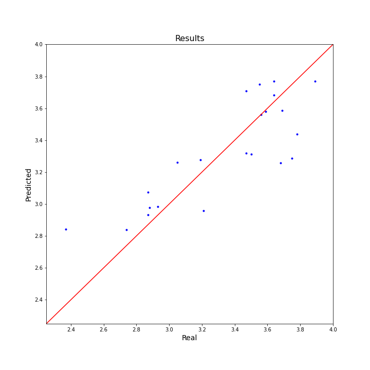

# Marathon Prediction Time

This notebook responds to a Dataset on Kaggle: https://www.kaggle.com/girardi69/marathon-time-predictions

# Limitations

* Data is very limited, in terms of quantity and relevant data. There are less than 100 rows and less than 10 columns
* A marathon is the results of a hard sesaon training. However, it is important to mention that there are external factors that can affect on the race day: such as not sleeping the day before because of the nerves, injuries...

# Results

As you can see in the notebook, the RSME is 0.24 hours, which is a bit lower than 15 minutes. That result it is not bad considering the limitations in terms of data discussed above 

